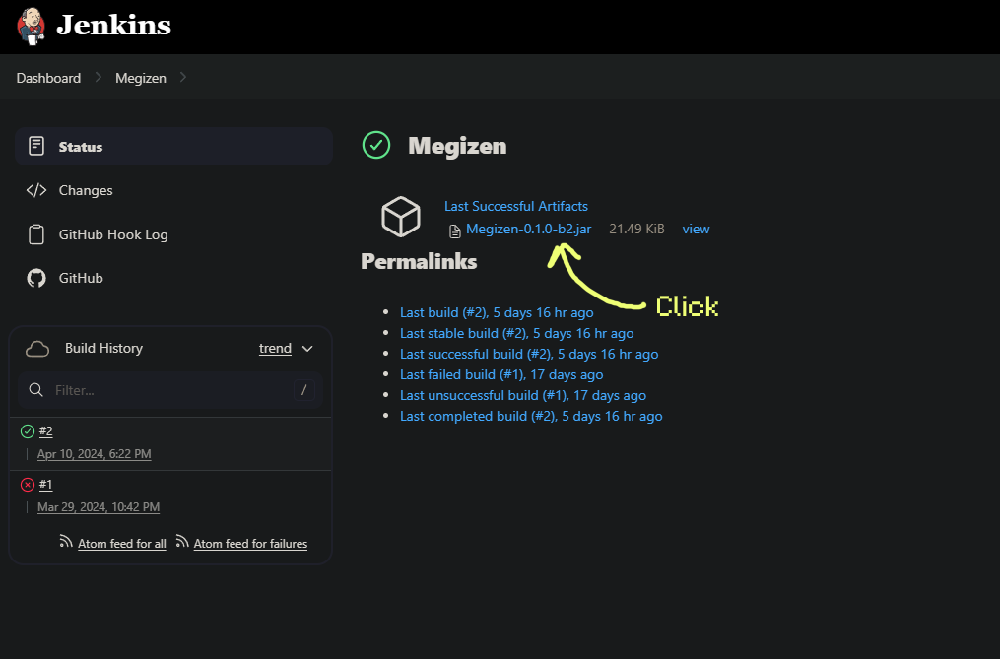
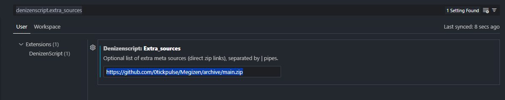
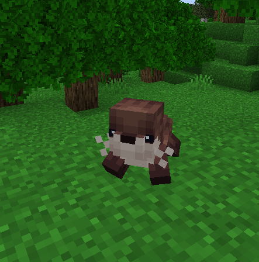
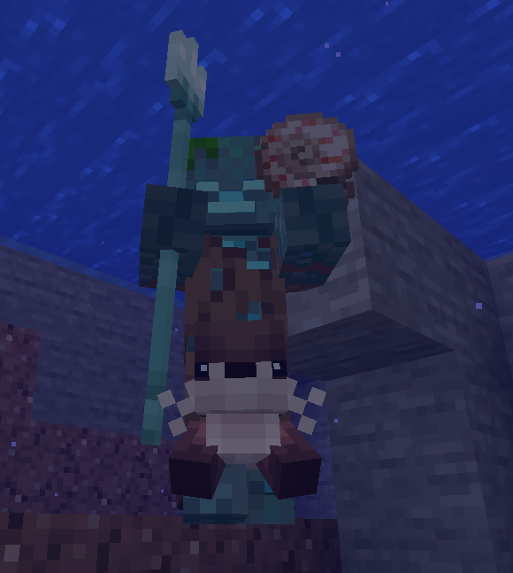
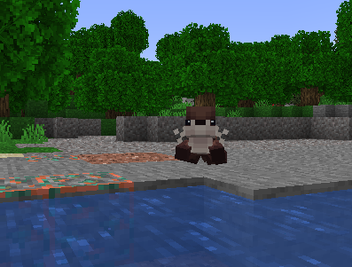

# Getting Started

Megizen is a powerful addon plugin for Denizen that adds interop with the ModelEngine API, allowing users to control models and animations using Denizen scripts.
However, it can be a bit tricky to get started with Megizen, so this guide will help you get up and running with Megizen.

## Prerequisites

Megizen requires the following plugins to be installed:

- [Denizen](https://denizenscript.com/)
- [ModelEngine R4.0+](https://mythiccraft.io/index.php?resources/model-engine%E2%80%94ultimate-entity-model-manager-1-19-4-1-20-4.1213/)

You should have a basic understanding of both of these plugins before using Megizen. You can learn more about Denizen [here](https://guide.denizenscript.com/) and ModelEngine [here](https://git.lumine.io/mythiccraft/modelengine/-/wikis/home).

## Installation

To install Megizen, firstly, open the plugin's [releases page](https://ci.heypr.dev/job/Megizen/) and click on Megizen:



This should download the latest version of Megizen. Once you have the jar file, move it to your server's `plugins` folder and restart the server.

## Setting Up the VSCode Extension

Since Megizen is an external tool, the Denizen VSCode extension doesn't recognize its tags and commands by default. To fix this, you can add the Megizen plugin to the Denizen extension's settings by following these steps:

1. Open the VSCode settings by pressing Ctrl (or Command) + , or by clicking on the gear icon in the bottom left corner.
2. Search for `denizenscript.extra_sources`.
3. Add this to the value: `https://github.com/0tickpulse/Megizen/archive/main.zip`.



## Setting Up a Model

As Megizen is a plugin that adds additional functionality to Denizen, you will interact with Megizen through Denizen scripts.

To get started, we will need a model to use. You can either make one using something like [Blockbench](https://blockbench.net/), or download a pre-existing one.

For the purposes of this guide, we'll use Nocsy's very adorable [Sleepy - the Otter](https://mcmodels.net/products/11051/sleepy-the-otter) model. Once you download it, extract the `nocsy_otter_v2.bbmodel` file from the `ModelEngine/blueprints` folder in the zip and place it in your server's `plugins/ModelEngine/blueprints` folder.

Run `/meg reload` (or restart the server) and then run `/meg summon nocsy_otter_v2` to make sure everything works.



## Writing a Denizen Script

Now that we have a model to use, we can write a Denizen script to fully control it.

Create a new script in your server's `plugins/Denizen/scripts` folder. You can name it whatever you want, but for this guide, we'll name it `sleepy_the_otter.dsc`.
Add the following code to the script:

```yml
sleepy_the_otter:
    type: entity
    entity_type: drowned
    mechanisms:
        should_burn: false
        can_pickup_items: false
        equipment: air|air|air|air
        silent: true

sleepy_the_otter_world:
    type: world
    events:
        on sleepy_the_otter dies:
        - determine NO_DROPS
        on sleepy_the_otter targets entity:
        - determine cancelled
```

The first thing we're going to do is to give it a model. To do so, we use our first Megizen command, `megmodel`. Add the following code to the script:

```yml
sleepy_the_otter:
    type: entity
    entity_type: drowned
    mechanisms:
        should_burn: false
        can_pickup_items: false
        equipment: air|air|air|air
        silent: true

sleepy_the_otter_world:
    type: world
    events:
        # highlight-start
        on sleepy_the_otter spawns:
        - megmodel entity:<context.entity> model:nocsy_otter_v2
        # highlight-end
        on sleepy_the_otter dies:
        - determine NO_DROPS
        on sleepy_the_otter targets entity:
        - determine cancelled
```

What this code does is apply the `nocsy_otter_v1` model to the entity when it spawns. Let's break it down:

- The `megmodel` command is used to apply a model to an entity.
- It takes primarily two arguments: `entity` and `model`.
- `entity` is the entity to apply the model to. In this case, we use `<context.entity>` to refer to the spawned otter mob.
- `model` is the model (or more precisely, blueprint) to apply. In this case, we use `nocsy_otter_v1`, which is the name of the blueprint we want to apply.

Now, save the script and run `/ex reload` to reload the scripts. Then, run `/ex spawn sleepy_the_otter` to spawn the otter with the model applied.



But do you see the problem? While we applied the model, the otter (which is a drowned) still displays its default model. We need to make its base mob invisible.

## Introducing the MegModeledEntityTag

The `MegModeledEntityTag` is an object type that represents an entity that can or does have models applied to it. It has a variety of tags that allow you to control the entity's model, one being [`MegModeledEntityTag.entity_visible`](/objecttype/MegModeledEntityTag#tag-megmodeledentitytagentity_visible).

To actually construct this object, we use another tag that Megizen introduces: [`EntityTag.modeled_entity`](/tags#tag-entitytagmodeled_entity). Combining this, we can make the entity invisible:

```yml
sleepy_the_otter:
    type: entity
    entity_type: drowned
    mechanisms:
        should_burn: false
        can_pickup_items: false
        equipment: air|air|air|air
        silent: true

sleepy_the_otter_world:
    type: world
    events:
        on sleepy_the_otter spawns:
        - megmodel entity:<context.entity> model:nocsy_otter_v2
        # highlight-start
        - adjust <context.entity.modeled_entity> entity_visible:false
        # highlight-end
        on sleepy_the_otter dies:
        - determine NO_DROPS
        on sleepy_the_otter targets entity:
        - determine cancelled
```

Here, we apply the `EntityTag.modeled_entity` tag to `<context.entity>`, which constructs a `MegModeledEntityTag` object. We then adjust the `entity_visible` key to `false`, making the entity invisible.

Reload the scripts and spawn the otter again. This time, the otter should be an otter instead of a weird drowned-otter hybrid.



## Conclusion

And that's it! You've successfully set up Megizen and applied a model to an entity using Denizen scripts. From here, you can explore the various commands and tags Megizen offers to control models and animations.

In the next guide, we'll explore how to animate models using Megizen. Stay tuned!
